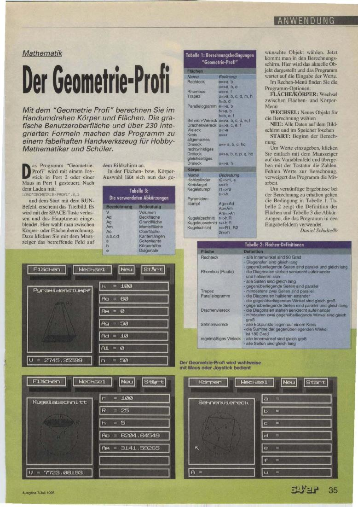

# Geometrie Profi
In this repo you can find the executables and sources of the C64 program `Geometrie Profi`.
It was first published in 64'er magazine in 1995.
The program was completely written in 6502/6510 assembly language with VisAss assembler.
It seems that the sources for the area calculation and also the graphics used for areas and 
geometrical bodies are missing.

---

